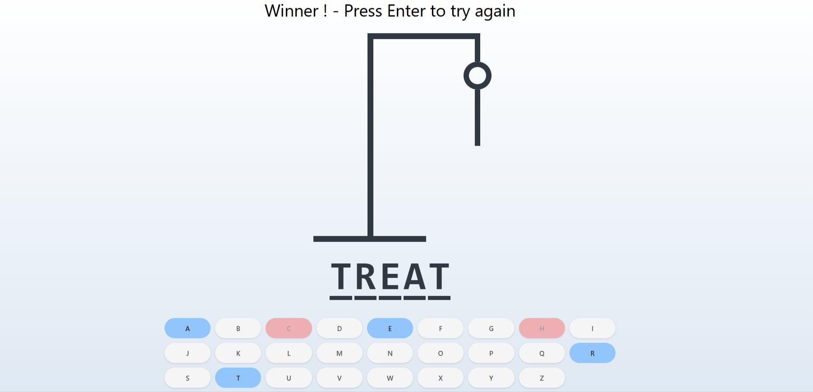

<div align="center">
  <a href="https://hangman-game-cm.netlify.app/"></a>
 <div align="center">
  
  
  
  </div>
  <h3 align="center">Hangman game</h3>
</div>

## <br /> 📋 <a name="table">Summary</a>

- ✨ [Introduction](#introduction)
- 🛠 [Technology Used](#tech-stack)
- 📝 [Features](#features)
- 🚀 [Launch App](#launch-app)
- 🎨 [Styling](#style)


## <br /> <a name="introduction">✨ Introduction</a>

**[ENG]** This project is a classic Hangman game built with TypeScript, Tailwind CSS, and Vite. Designed for an engaging and interactive experience, it allows players to guess letters and uncover a hidden word. The game is optimized for a smooth and responsive user experience, leveraging my expertise in React and TailwindCSS.

**[FR]** Ce projet est un jeu du Pendu classique développé avec TypeScript, Tailwind CSS et Vite. Conçu pour offrir une expérience ludique et interactive, il permet aux joueurs de deviner des lettres pour révéler un mot caché. Le jeu est optimisé pour une expérience utilisateur fluide et réactive, s’appuyant sur mon expertise en React et en TailwindCSS

## <br /> <a name="tech-stack">🛠 Technology Used</a>

- [TypeScript](https://www.typescriptlang.org/)
 is a statically typed superset of JavaScript, offering better code quality, scalability, and maintainability. TypeScript enables developers to catch errors early, provides better code completion, and helps ensure consistency across large projects.

- [TailwindCSS](https://tailwindcss.com/docs/installation)
Tailwind CSS is a valuable tool for developers who want to build modern, responsive, and visually appealing websites without sacrificing development speed.

## <a name="features">📝 Features</a>

👉 **Word Generation** : Generates a random word from a predefined list.

👉 **Word Display**: Displays the word as a series of underscores, revealing guessed letters.

👉 **Keyboard Input:** :

  - **Keyboard** : Players can use their physical keyboard to input guesses.

  - **On-screen Keyboard**: Players can click on virtual keyboard buttons to input guesses. 
  
👉 **Letter Disabling**: Once a letter is guessed, it is disabled to prevent repeated guesses.

👉 **Win/Lose Conditions** :

  - **Win** : The player wins by guessing all letters correctly. Correct guesses are displayed in blue.

  - **Lose** : The player loses if they exhaust all incorrect guesses. Incorrect guesses are displayed in red. 


## <br /> <a name="launch-app">🚀 Launch App</a>

Follow these steps to set up the project locally on your machine.

**Prerequisites**

> [!NOTE]
> Make sure you have the following installed on your machine:

- [Git](https://git-scm.com/)
- [Node.js](https://nodejs.org/en)
- [npm](https://www.npmjs.com/) _(Node Package Manager)_

**Cloning the Repository**

```bash
git clone {git remote URL}
cd {git project..}
```

**Installation**

> After cloning the repository, run the command `npm i` or `yarn i` to install the project's dependencies.

_npm_

```
npm install
```

_yarn_

```
yarn install
```

> Once the dependencies are installed, start the project with the command `npm run dev`.

# <br /> <a name="style">🎨 Styling</a>

Global styling are defined using **CSS** & **TailwindCSS**

<details>
<summary><code>index.css</code></summary>

```css
@tailwind base;
@tailwind components;
@tailwind utilities;

* {
  margin: 0;
  padding: 0;
  box-sizing: border-box;
}

body {
  width: 100dvw;
  overflow-x: hidden;
  height: 100%;
  background: linear-gradient(to top, #dfe9f3 0%, white 100%);
}
```

</details>

<details>
<summary><code>tailwind.config.js</code></summary>

````cjs
theme: {
    extend: {
      colors: {
        blackLight: "#303841",
      },
        gridTemplateColumns:{
        'auto-fit-75': 'repeat (auto-fill, minmax(75px, 1fr)'
      }
    },
  },
````

</details>
